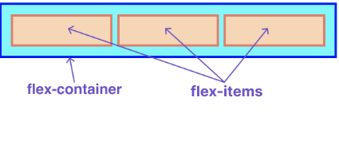
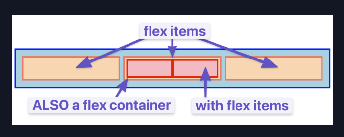

#INTRODUCTION TO FLEXBOX

- Flexbox is a way to arrange items into rows or columns.
- These items will flex (grow or shrink) based on some rules that you can define.
- In a flex container, all flex items will fit the available area and will each have equal width.

- With flex, there is the flex container and the flex items.
- Flex Container:
    - The parent container that is wrapped around all flex items. (ex: 
 or )
    - Any element that has "display: flex;" on it.
- Flex Items:
    - Any element that lives directly inside of a flex container.

- Any element can be both a flex container and a flex item.
- You can put "display: flex;" on a flex item and then use flexbox to arrange its children.

- Creating and nesting multiple flex containers is the primary way to build up complex layouts.

